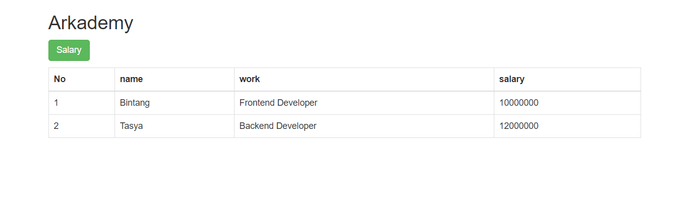

# bootcamp_arkademy_
software => windows OS, xampp, browser.

how to use : install xampp on windows OS;
put file to your directory ../xampp/htdocs
starting apache as server and database mysql within xampp.
import the database.

open browser and put url localhost/dir.

